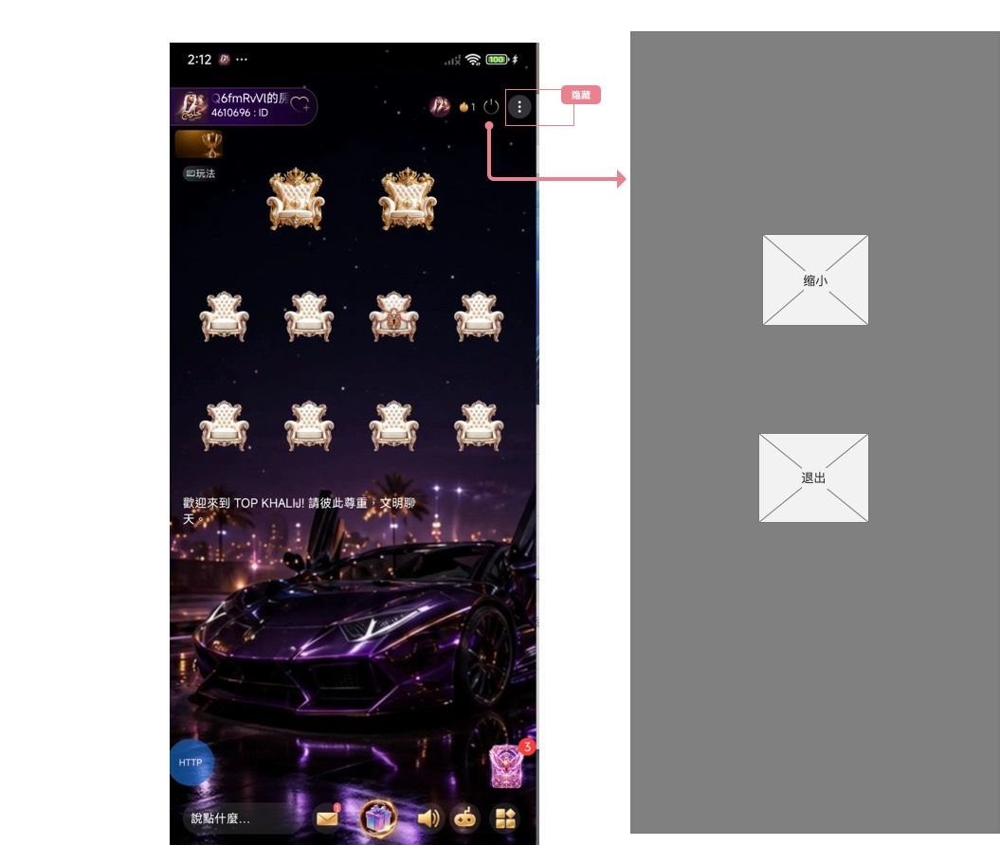
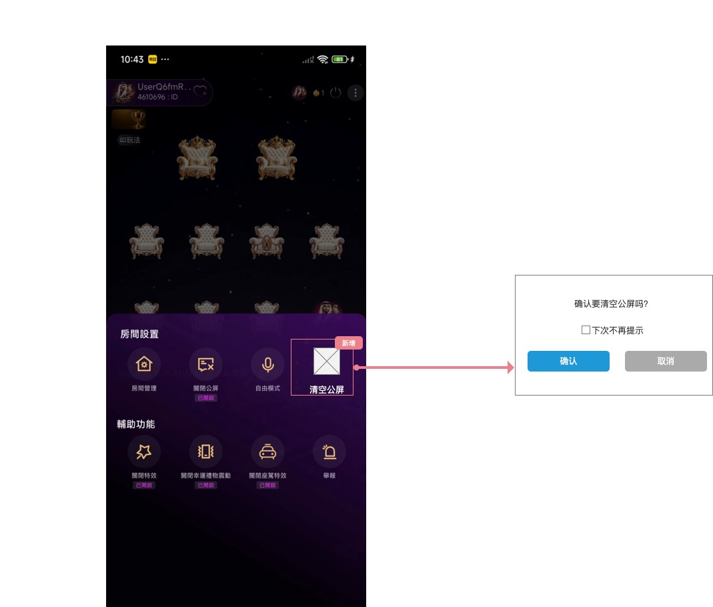
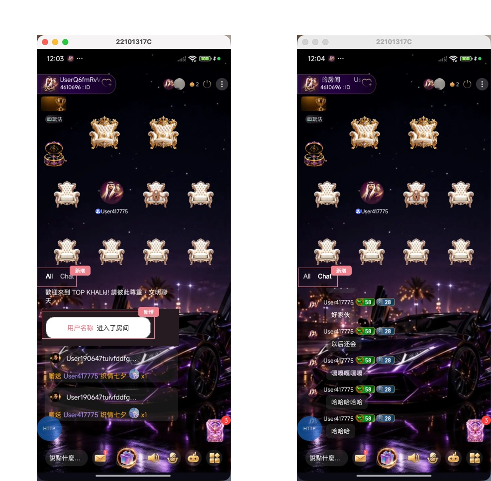
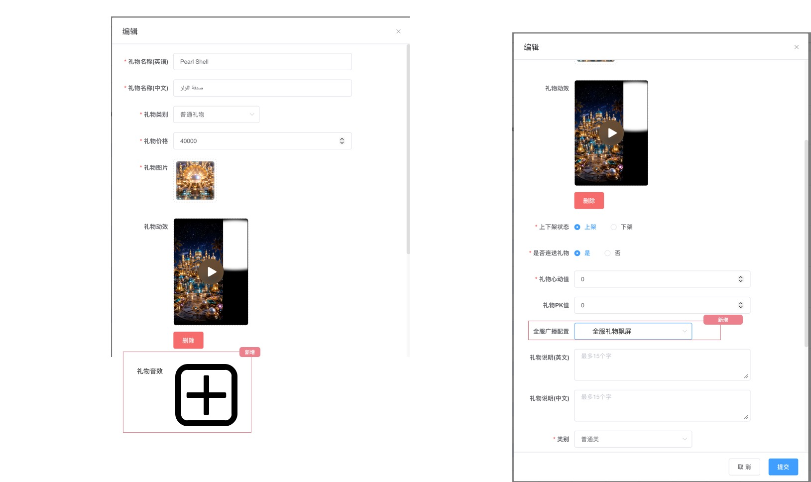
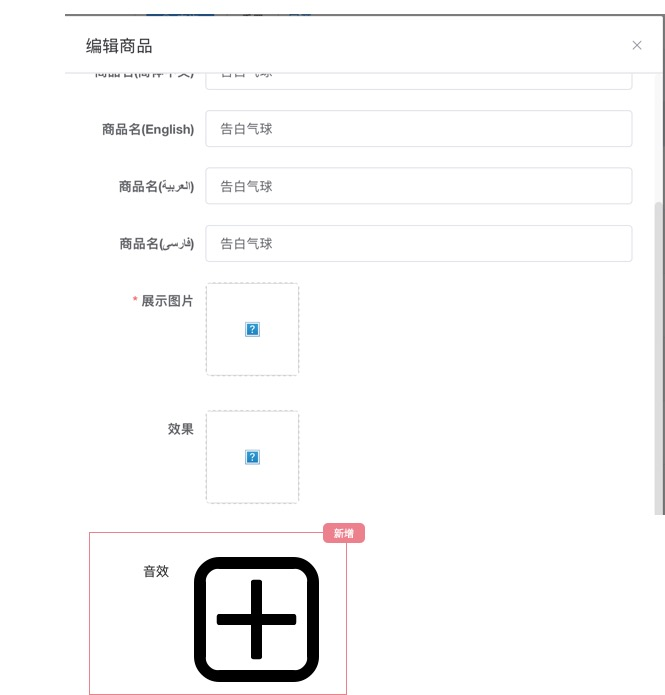

# TOPKHALIJ 2.1.30 需求文档（拆分版）

| 项目 | 内容 |
|---|---|
| 产品 | TOPKHALIJ |
| 版本 | 2.1.30 |
| 文档状态 | 按版本拆分后的正式范围 |
| 拆分依据 | 用户确认保留：礼物动画、房间 Banner、麦位调整、充值成功弹窗、公屏消息分类、清屏功能、退出房间优化，以及礼物/座驾动画关联后台功能 |
| 脑图来源 | `TOPKHALIJ_2.1.30.xmind`（拆分版） |
| 原型来源 | `2.1.21原型图/` 下 9 张 JPG |

## 一、版本目标与范围

本版本仅承接房间内展示与操作体验、礼物/座驾 PAG+MP3 动效兼容及其后台音效配置。

| 端 | 本次模块 |
|---|---|
| 客户端 | 房间 Banner、麦位调整、礼物/座驾动画、退出房间优化、清空公屏、公屏消息分类、充值成功弹窗 |
| 后台 | 礼物音效上传、座驾音效上传 |

### 1.1 源材料采用原则

1. 脑图用于确认业务规则与范围；原型用于确认页面结构、字段位置和展示形态。
2. `__banner.jpg` 是真实业务页面原型；脑图未单列 Banner 节点，但已按本次版本拆分决策保留。
3. 原型未展示、脑图也未描述的字段、限制、数值和流程不补造，统一列在待确认项。
4. 例图中的用户名、ID、礼物名、金额、日期和房间号均为展示样例，不作为业务配置值。

---

## 二、全局规则

### 2.1 PAG 动效与 MP3 音效规则

| 对象 | 动效 | 音效 |
|---|---|---|
| 礼物 | 房间内兼容 PAG 格式礼物动效 | 后台礼物音效仅支持上传 MP3，用于礼物 PAG 动效播放。 |
| 座驾 | 房间内兼容 PAG 格式座驾动效 | 后台仅在选择座驾类型时展示音效入口；音效仅支持 MP3。 |

- 本次只定义格式兼容与上传入口，不新增原型未展示的文件大小、时长、码率、音量、循环次数等限制。
- 礼物动效、座驾动画和对应音效应作为同一次展示体验处理；音效播放失败、静音策略和并发抢占策略见待确认项。

---

---

# 三、客户端需求

## 3.1 房间 Banner

#### 对应原型

### 3.1.1 页面定位

在房间页面底部功能区上方新增 Banner 展示位。原型中的 Banner 为占位样式，实际视觉素材由运营配置提供。

### 3.1.2 展示与切换规则

| 规则 | 说明 |
|---|---|
| 多 Banner | 支持配置多个 Banner。 |
| 排序 | 根据序号降序轮播。 |
| 手势 | 用户可左右滑动查看不同 Banner。 |
| 位置 | 固定在房间页底部功能区上方的 Banner 位，不遮挡底部核心操作区。 |

### 3.1.3 范围边界

- 原型未定义 Banner 点击跳转、自动轮播间隔、循环方式、关闭能力、数量上限、展示频控和后台配置页面；这些内容不在本文档中补造。
- 该模块仅出现于原型、未在脑图单列；已按本次版本拆分决策保留在 2.1.30。

---

---

## 3.2 房间麦位尺寸调整

#### 对应原型

### 3.2.1 调整范围

| 麦位数量示意 | 原型布局 | 本次调整 |
|---|---|---|
| 多麦位房间 | 原型展示约 18 个麦位、三行排列 | 放大麦位视觉尺寸及对应布局占位。 |
| 10 麦房间 | `2 + 4 + 4` 布局 | 放大麦位视觉尺寸及对应布局占位。 |

### 3.2.2 展示规则

- 不同麦位数量下的麦位尺寸均需调整放大。
- 放大后仍保持当前麦位数量、相对层级和排布结构；不因视觉尺寸变化改变上麦、下麦、邀请、禁言、座位状态等既有业务规则。
- 具体宽高、间距、红线区域边界以最终设计稿为准；当前原型未给出可落地尺寸数值。

---

---

## 3.3 房间礼物与座驾动画兼容

#### 对应原型

### 3.3.1 展示范围

| 类型 | 原型表现 |
|---|---|
| 礼物动画 | 房间顶部展示用户、赠送提示、礼物动效和连送数量的横幅式效果。 |
| 座驾动画 | 房间中部/下部展示座驾驶入及场景动效。 |

### 3.3.2 兼容规则

- 房间需兼容 `PAG + MP3` 格式的礼物动画和座驾动画。
- 礼物动效与座驾动效应按各自物料配置展示；未配置本次新增音效的既有物料继续沿用原有展示结果。
- 本次仅处理素材格式兼容，不新增原型未说明的连送合并策略、动画抢占策略或音频混音规则。

---

---

## 3.4 退出房间入口优化

#### 对应原型

### 3.4.1 入口调整

| 区域 | 调整 | 规则 |
|---|---|---|
| 房间页右上角菜单入口 | 隐藏 | 本版本不再通过右上角菜单入口承载退出房间操作。 |
| 房间关闭按钮 | 展开操作项 | 点击关闭按钮后展示 `缩小` 与 `退出` 两个操作项。 |
| `缩小` | 缩小房间并返回主页 | 点击后将当前房间缩小，并返回主页。 |
| `退出` | 退出房间 | 点击后退出当前房间。 |

### 3.4.2 边界

- 脑图已明确操作入口、`缩小`与`退出`两项行为；不得再将两项操作误写为右上角隐藏菜单的操作项。
- 脑图与原型均未定义点击“退出”后的二次确认、取消按钮或退出成功提示；本版本不补造对应流程。
- 脑图仅明确“缩小房间并返回主页”，未定义缩小后的悬浮形态、房间音频是否保留及其后续交互。

---

---

## 3.5 房间清屏功能（待定）

#### 对应原型

### 3.5.1 入口与弹窗

| 区域 | 可见内容 | 规则 |
|---|---|---|
| 房间设置 | 新增“清空公屏”入口，入口带“新增”标识 | 在房间设置面板中提供清空公屏操作。 |
| 确认弹窗 | `确认要清空公屏吗？` | 点击“清空公屏”后展示确认弹窗。 |
| 提示偏好 | `下次不再提示`复选框 | 用户可在确认弹窗中勾选或不勾选该项。 |
| 弹窗操作 | `确认`、`取消` | 弹窗提供确认与取消两个操作。 |

### 3.5.2 清空规则

- 点击 `确认`：清空 `All` 与 `Chat` 分类内的**所有公屏消息**，并 Toast 提示：`已清空公屏`。
- 点击 `确认` 且已勾选 `下次不再提示`：本次按上述规则清空消息；该偏好生效后，下次点击“清空公屏”按钮时直接清空公屏消息，不再展示二次确认框，并 Toast 提示：`已清空公屏`。
- 点击 `取消`：关闭二次确认框，不清空公屏消息。

### 3.5.3 边界

- 脑图明确清空范围包含 `All` 与 `Chat` 两类中的所有公屏消息；不得仅清除当前选中分类或仅清除聊天消息。

---

---

## 3.6 房间公屏消息分类

#### 对应原型

### 3.6.1 分类规则

公屏顶部新增 `All` 与 `Chat` 标签入口，默认选中 `All`。

| 标签 | 展示规则 | 红点规则 |
|---|---|---|
| `All` | 展示房间所有公屏消息，沿用当前既有全量消息展示能力。 | 当前未选中 `All` 时，若 `All` 收到新消息且该消息**不是当前用户本人发言**，显示红点。 |
| `Chat` | 仅展示房间用户发言的消息，不展示系统消息。 | 脑图未定义。 |

### 3.6.2 新增进场消息

- 用户进入房间时，公屏展示该进房用户的进场消息。
- 图示消息文案结构为：`用户名 + 进入了房间`。

### 3.6.3 已确认展示字段

| 消息类型 | 可见字段/文案结构 |
|---|---|
| 欢迎消息 | 欢迎语文本。 |
| 进入房间提示 | 用户名 + `进入了房间`。 |
| 礼物消息 | 送礼用户头像与昵称 + `赠送` + 收礼方/目标用户名 + 礼物名称 + 礼物图标 + 数量。 |
| 普通聊天消息 | 用户头像、用户名、图示等级/数值徽标、文本内容。 |

### 3.6.4 消息视觉样式

| 标签 | 图示可见消息样式 |
|---|---|
| `All` | 欢迎文字直接叠在房间背景；进入房间提示为深色底板上的白色圆角卡片，用户名使用粉色；礼物消息带头像、昵称、赠送关系、礼物名称、礼物图标和数量。 |
| `Chat` | 普通文本聊天消息；每条展示头像、用户名、图示等级/数值徽标和深色半透明文本气泡。 |

### 3.6.5 边界

- 脑图已定义默认选中 `All`、`All`/`Chat` 的筛选范围及 `All` 红点触发条件；不得再将这些规则列为待确认。
- 图中徽标数值仅为展示示例，本文档不将其固定为等级、财富、魅力或其他业务字段。
- 脑图未定义标签切换后的历史消息加载、排序、保留时长、`Chat` 红点规则、屏蔽规则或推送规则。
- 本次不改变输入框、礼物入口、音效入口及房间其他既有操作。

---

---

## 3.7 充值成功弹窗

#### 对应原型

### 3.7.1 弹窗展示

用户在**任意位置**完成充值后，显示充值成功弹窗提示；背景页面保持可见但被前景弹窗覆盖。

| 区域 | 展示规则 |
|---|---|
| 成功提示 | 展示用户本次充值成功的价格（美元）与获得的金币数量。 |
| 获得资产 | 以大号数字展示本次获得金币数量及 `金币` 资产类型。 |
| 主操作 | 展示 `收下` 按钮。 |

### 3.7.2 交互规则

- 点击 `收下`：关闭充值成功弹窗。

### 3.7.3 边界

- 脑图已定义任意位置完成充值均触发弹窗、展示美元价格与金币数量，以及“收下”关闭弹窗；不得再将这些规则列为待确认。
- 原型未展示独立关闭按钮；不得擅自增加关闭入口。
- 弹窗示例中的具体充值金额、金币数和背景档位为视觉样例，不作为本版本固定充值配置。
- 脑图未定义余额刷新时点、重复充值成功弹窗的并列/覆盖策略及重复点击拦截口径。

---

---

# 四、后台需求

## 4.1 礼物管理：礼物音效

#### 对应原型

### 4.1.1 礼物音效

- 在礼物编辑表单中新增“礼物音效”上传入口。
- 仅允许 MP3 文件作为礼物音效。
- 礼物 PAG 动效播放时，读取该礼物已配置的音效。
- 原型仅展示新增入口，未展示文件名、试听、替换、删除、音频时长和容量限制；不在本次擅自增加表单字段或交互。

---

## 4.2 物料管理：座驾音效

#### 对应原型

### 4.2.1 表单字段

| 字段 | 展示条件 | 规则 |
|---|---|---|
| 音效 | 仅选择座驾类型时显示 | 提供新增音效入口，仅支持上传 MP3，用于座驾 PAG 动效播放。 |

### 4.2.2 交互与边界

- 原型展示“音效”字段及新增“+”入口；不展示文件预览、试听、替换、删除和保存按钮，本文档不追加未展示交互。
- 当物料类型不是座驾时，音效上传入口不展示。
- 已配置座驾音效后再切换为非座驾类型时，已上传音效如何处理未定义，见待确认项。

---

---

# 五、源材料覆盖核对

| 脑图/原型模块 | PRD章节 | 原型文件 | 覆盖结论 |
|---|---|---|---|
| 礼物动画：房间兼容 PAG+MP3 礼物和座驾 | 2.1、3.3、4.1、4.2 | 礼物动画.jpg、礼物管理.jpg、物料管理-座驾.jpg | 已覆盖 |
| 原型补充：房间 Banner 多图轮播 | 3.1 | __banner.jpg | 已按版本拆分决策保留 |
| 麦位尺寸调整 | 3.2 | 麦位调整.jpg | 已覆盖 |
| 脑图：退出房间优化 | 3.4 | 退出房间优化.jpg | 已覆盖 |
| 脑图：清空公屏 | 3.5 | 清屏功能.jpg | 已覆盖 |
| 脑图：公屏消息分类与进场消息 | 3.6 | 公屏消息分类.jpg | 已覆盖 |
| 脑图：充值成功弹窗 | 3.7 | 充值成功弹窗.jpg | 已覆盖 |

---

# 六、待产品确认项

| 编号 | 模块 | 待确认内容 | 影响 |
|---:|---|---|---|
| 1 | 礼物/座驾音效 | 音频失败、用户静音、多个 PAG+MP3 动效并发时的播放与抢占策略。 | 房间体验。 |
| 2 | 房间 Banner | 自动轮播间隔、点击跳转、数量上限、空态、频控及后台配置方式。 | 展示与运营配置。 |
| 3 | 麦位调整 | 各麦位数量对应的最终尺寸、间距和适配断点。 | 设计与客户端实现。 |
| 4 | 座驾音效 | 已上传音效后物料从座驾改为其他类型时，音效保留、清空或禁止切换的规则。 | 物料数据一致性。 |
| 5 | 退出房间 | 点击“退出”后是否存在二次确认、退出成功提示；缩小后的悬浮形态、房间音频是否保留及后续交互。 | 房间退出体验。 |
| 6 | 清空公屏 | “下次不再提示”的保存范围、重置入口、跨端同步；清空消息是否可恢复、清空后的滚动位置、取消时是否保存偏好。 | 公屏消息与用户提示一致性。 |
| 7 | 公屏消息分类 | 标签切换后的历史消息加载、排序、保留时长、`Chat` 红点规则、屏蔽规则及推送规则。 | 消息展示一致性。 |
| 8 | 充值成功弹窗 | 余额刷新时点、重复充值成功弹窗的并列/覆盖策略及重复点击拦截口径。 | 充值结果确认体验。 |
